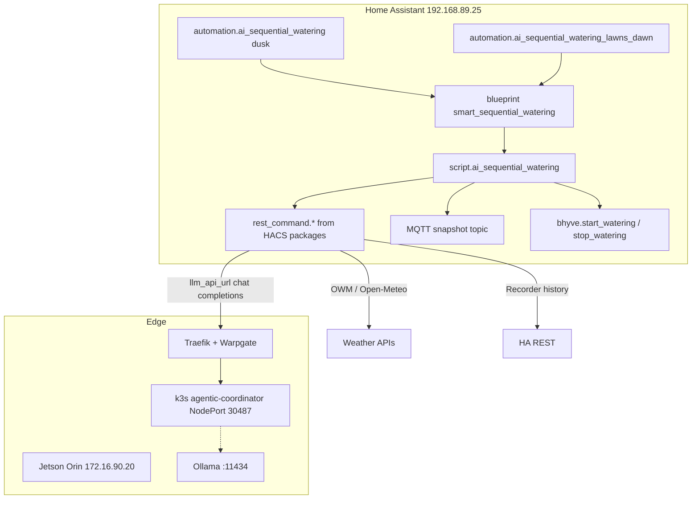

# Garden Agentic Watering

Site documentation for the LLM-driven sequential irrigation stack: Home Assistant blueprints/packages, the HACS **Agentic Watering** integration, BHyve valves, and the Jetson-hosted OpenAI-compatible LLM endpoint.

For the operator wiki page, see [Home Assistant Irrigation & AI Watering](https://github.com/zlatko-lakisic/My-Futuristic-Home/wiki/Home-Assistant-Irrigation-AI-Watering).

## Related repositories

| Repo | Role |
|------|------|
| [hacs-agentic-watering](https://github.com/zlatko-lakisic/hacs-agentic-watering) | HACS integration + blueprint + generic script/REST packages (`v1.2.0` on HA) |
| [My-Futuristic-Home](https://github.com/zlatko-lakisic/My-Futuristic-Home) | Site YAML: zones, blueprint inputs, instance helpers, dashboards, sync |
| [agentic-orchestration](https://github.com/zlatko-lakisic/agentic-orchestration) | Jetson k3s coordinator / warm pool / plant-knowledge MCP / OpenAI-compatible edge |
| [hacs-msnswitch](https://github.com/zlatko-lakisic/hacs-msnswitch) | Power watchdogs (NAS2 + Omega Jetson outlet among others) |
| [docker-infrastructure](https://git.omega-it.solutions/omegait/docker-infrastructure.git) | Traefik + Warpgate route for `ai-orchestrator.mostardesigns.com` → `172.16.90.20:30487` |

## Architecture (current)



1. **Dusk** (sunset) and **dawn** (sunrise, Jun 30–Sep 1, East + Kitchen lawns only) automations use the HACS blueprint.
2. Blueprint calls **`script.ai_sequential_watering`** with site zone catalogs from `homeassistant/includes/`.
3. Script gathers forecast + past rain + soil/valve history, then one **per-zone** LLM call via `rest_command.ollama_chat_completions`.
4. LLM endpoint: `https://ai-orchestrator.mostardesigns.com/v1/chat/completions` (LAN clients may bypass Warpgate on `/v1/*`).
5. Zones run **sequentially** through Orbit BHyve with settle delays; run state is snapshotted to MQTT for resume-after-restart.

## What lives where

### Shipped by HACS (`custom_components/agentic_watering/`)

| Path | Purpose |
|------|---------|
| `packages/smart_sequential_watering_script.yaml` | `script.ai_sequential_watering` |
| `packages/rest_command_ai_watering.yaml` | OWM, Open-Meteo (72h past), HA history, chat completions |
| `blueprints/automation/zlatko-lakisic/smart_sequential_watering.yaml` | Dusk/dawn/manual trigger wrapper |

Live HA `configuration.yaml` includes those packages:

```yaml
rest_command_ai_watering: !include custom_components/agentic_watering/packages/rest_command_ai_watering.yaml
smart_sequential_watering_script: !include custom_components/agentic_watering/packages/smart_sequential_watering_script.yaml
smart_sequential_watering_instance: !include packages/smart_sequential_watering_instance.yaml
```

### Site-only (this repo)

| Path | Purpose |
|------|---------|
| `packages/smart_sequential_watering_instance.yaml` | Helpers, MQTT snapshot sensor, resume automation, `script.ai_watering_simulate_test` |
| `includes/smart_watering_zones.yaml` | Full dusk zone catalog (9 zones) |
| `includes/smart_watering_lawns_zones.yaml` | Dawn: East Lawn + Kitchen Lawn |
| `includes/smart_watering_blueprint_input.yaml` | Dusk blueprint inputs |
| `includes/smart_watering_lawns_dawn_blueprint_input.yaml` | Dawn blueprint inputs |
| `includes/smart_watering_runtime_script_params.yaml` | Shared runtime helper IDs |
| `automations/03_bhyve_ai_dusk_watering.yaml` | Dusk blueprint instance |
| `automations/03b_ai_lawns_dawn_watering.yaml` | Dawn blueprint instance |
| `packages/bhyve_manual_zone_resolve.yaml` | Manual UI zone picker |
| `packages/irrigation_zone_runtime_7d.yaml` | Daily open-time history_stats for backyard charts |
| `dashboards/backyard.yaml` | Irrigation tiles + soil moisture |

## Live entities (verified Jul 2026)

| Entity | Role | Notes |
|--------|------|-------|
| `automation.ai_sequential_watering` | Dusk run | **on**; last triggered ~sunset |
| `automation.ai_sequential_watering_east_kitchen_lawns_dawn` | Dawn lawns | **on**; seasonal window |
| `automation.ai_sequential_watering_resume_after_restart` | Resume | In instance package |
| `script.ai_sequential_watering` | Main pipeline | HACS package |
| `script.ai_watering_simulate_test` | Dry run | `simulate: true` |
| `input_select.ai_dusk_watering_ollama_model` | Model pick | Default `qwen2.5:14b-instruct` |
| `sensor.ai_watering_active_run_config` | MQTT snapshot | Retained topic `homeassistant/ai_watering/active_run_config` |

Legacy entities (`script.ai_dusk_sequential_watering`, `automation.ai_dusk_sequential_watering`, `automation.bhyve_ai_dusk_sequential_watering`) remain **unavailable/restored** after the HACS cutover — ignore them.

## Dusk zone list

From `includes/smart_watering_zones.yaml`: East Lawn, Flower Bed, Front Lawn, Slope Kitchen Left, Peppers and Kale, Tomato, Zucchini, Kitchen Lawn, Corn.

Actuation services: `bhyve.start_watering` / `bhyve.stop_watering`.

## LLM endpoint & Jetson

- Public/LAN URL used by HA: `https://ai-orchestrator.mostardesigns.com/v1/chat/completions`
- Upstream host: **Omega Jetson Orin** `172.16.90.20` (IoT WLAN), hostname `omega-jetson-orin.mostardesigns.com`
- Checkout on device: `/var/projects/agentic-orchestration` → [agentic-orchestration](https://github.com/zlatko-lakisic/agentic-orchestration)
- Deploy: `bash …/scripts/jetson-deploy.sh` (git pull only; no SCP)
- k3s namespace `agentic-orchestration`: coordinator NodePort **30487**, warm pool, delegation broker
- Host Ollama (`systemctl` active) at `:11434` with OpenAI-compatible `/v1/*`
- Plant knowledge MCP hostPath + `HOME_ASSISTANT_URL=https://ha.mostardesigns.com` for orchestrator agents

See [infrastructure/jetson_agentic_orchestration.md](../../infrastructure/jetson_agentic_orchestration.md).

**Ops note (Jul 2026):** HA model helper still lists larger tags (`qwen2.5:14b-instruct`, `gemma4:26b`, …). Host Ollama currently advertises **`llama3.2:3b`**. Align the helper / `default_llm_model` with whatever is pulled on the Jetson before relying on dusk runs.

## Deploy / test

```powershell
# Push site YAML to HA Samba share
powershell -ExecutionPolicy Bypass -File scripts/sync_homeassistant_config.ps1

# Dry-run (no valves)
# Developer tools → Actions → script.ai_watering_simulate_test
```

HACS upgrades: update **Agentic Watering** in HACS, restart HA, keep package includes unchanged.

## Related in-repo docs

- [homeassistant/README.md](../README.md)
- [infrastructure/msn_switches.md](../../infrastructure/msn_switches.md) — MSNSwitch HACS + Jetson power path
- [services/traefik.md](../../services/traefik.md) — edge routing (detail also in docker-infrastructure Traefik README)
