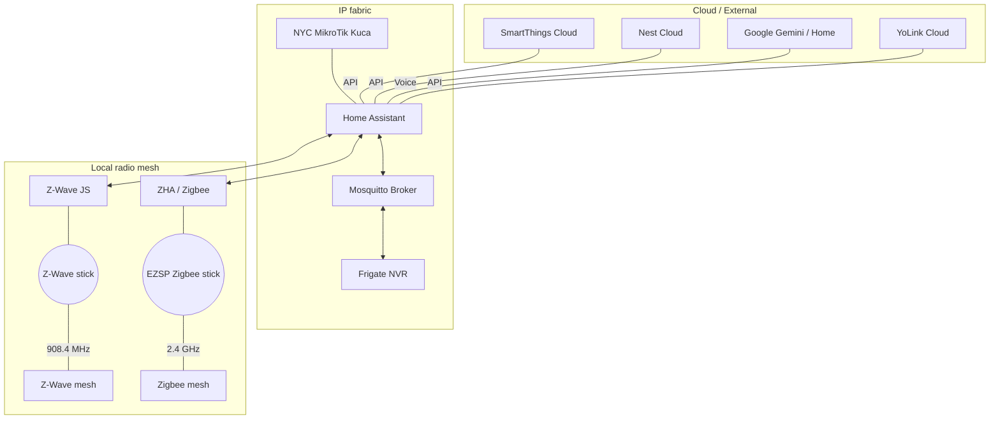

# 📡 Radio & Network Topology

This document maps the wireless protocols and communication paths used by **My Futuristic Home**. It serves as a guide for troubleshooting interference and understanding device dependencies.

IP VLANs, Mostar L2TP, and torrent breakout live in [`../../infrastructure/networking.md`](../../infrastructure/networking.md) — this page covers radio/cloud paths into Home Assistant.

## System architecture

