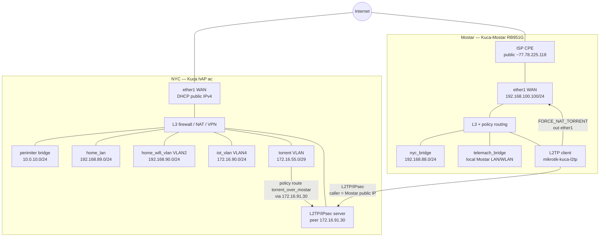
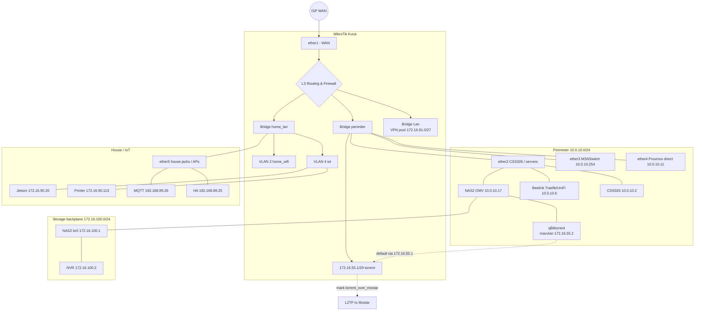
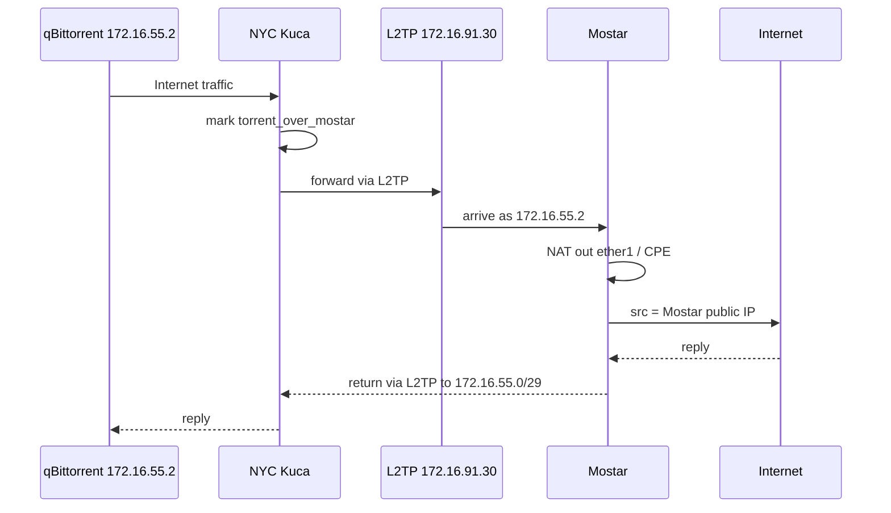

# Network Topology & VLANs

Live reference (2026-07-27): NYC `Kuca` (RB962UiGS-5HacT2HnT, ROS 7.23.2) and Mostar `Kuca-Mostar` (RB951G-2HnD, ROS 7.23.2). Detailed RouterOS notes: [`mikrotik_config.md`](mikrotik_config.md), [`mikrotik_mostar_config.md`](mikrotik_mostar_config.md). Subnet tables: [`networks.md`](networks.md).

---

## Site overview

---

## NYC logical topology

---

## Torrent breakout (NYC → Mostar public IP)

qBittorrent on NAS2 is dual-homed:

| Network | Address | Role |
| --- | --- | --- |
| `torrent-vlan` (macvlan) | `172.16.55.2/29` gw `172.16.55.1` | **Default route** — BitTorrent egress |
| `plex-network` | `172.16.101.4/24` | Arr stack / WebUI adjacency |

Path when healthy:

1. NYC mangle: `src=172.16.55.2` + `dst !Local` → routing-mark `torrent_over_mostar`
2. NYC route table `torrent_over_mostar`: `0.0.0.0/0` → **`172.16.91.30`** (Mostar L2TP peer; `check-gateway=ping`)
3. Mostar mangle: same src → table `torrent_over_mostar` → ISP gw `192.168.100.1` with `pref-src=192.168.100.100`
4. Mostar NAT `FORCE_NAT_TORRENT` masquerades out `ether1 - wan`
5. ISP CPE NATs to public IPv4 (tracked in HA as `sensor.mikrotik_mostar_environment_publicip`)

**Do not** point the NYC marked default at `172.16.91.2` (WireGuard) while `wg-mostar` / Mostar `wg-nyc` peer are disabled — that route goes inactive and torrent traffic falls back to the NYC WAN.

---

## Mostar site

| Piece | Live state |
| --- | --- |
| WAN | Static `192.168.100.100/24`, gw `192.168.100.1` (behind ISP CPE NAT) |
| Preferred default | L2TP `mikrotik-kuca-l2tp` → NYC (`add-default-route=yes`, distance 1) |
| Backup default | ISP `192.168.100.1` distance 2 |
| `nyc_bridge` | `192.168.88.1/24` + SSID `Kuca-NYC` — clients policy-routed toward NYC (`via_nyc`) |
| `telemach_bridge` | Local Mostar wired + SSID `Kuca-Mostar` |
| WireGuard `wg-nyc` | Interface up, **peer disabled** (standby) |
| Public IP script | `hacs-public-wan-ip` every 5m → `:global PublicIP` |

---

## VPN summary

| Path | NYC | Mostar | Addressing |
| --- | --- | --- | --- |
| **L2TP/IPsec** | Server enabled | Client running | Mostar `172.16.91.30` ↔ NYC `172.16.91.1` |
| OpenVPN | Server enabled | Client **disabled** | Reserved `172.16.91.29` |
| WireGuard | `wg-mostar` **disabled** | `wg-nyc` peer **disabled** | Would be `172.16.91.1/30` ↔ `172.16.91.2/30` |

NYC static routes: `192.168.88.0/24` and `192.168.100.0/24` → `172.16.91.30`.

---

## Related docs

- [`networks.md`](networks.md) — subnet inventory  
- [`mikrotik_config.md`](mikrotik_config.md) / [`mikrotik_mostar_config.md`](mikrotik_mostar_config.md)  
- [`switching.md`](switching.md) — CSS326 / house switch  
- [`../storage/nas2.md`](../storage/nas2.md) — OMV + torrent macvlan  
- [`../homeassistant/docs_ha/radio_topology.md`](../homeassistant/docs_ha/radio_topology.md) — Z-Wave / Zigbee / cloud radios  
